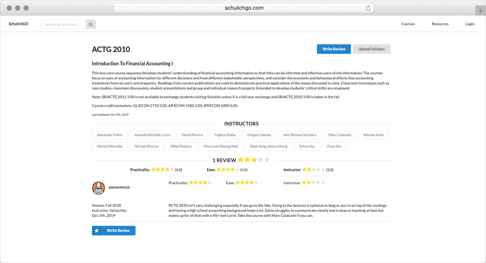
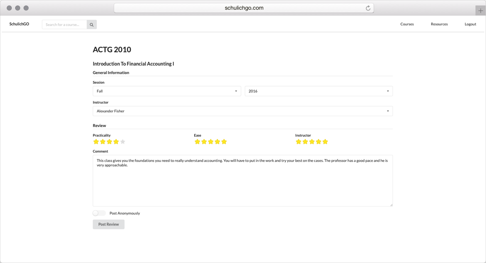

# SchulichGO

SchulichGO is a web application that makes the course selection process significantly easier. SchulichGO centralizes all the information needed to make course selection decisions, such as course descriptions, a list of all instructors teaching the course, and reviews from other students.

The web application was built using Django and JavaScript, with PostgreSQL as a database.

## Features

Students can browse the courses by their categories.

On a course page, students are able to get the description about the course, along with any prerequisites. There is also a list of instructors that teach the course. Students are also able to see the reviews, which are based on 3 factors: how practical the course is, the course's level of difficulty (ease), and the instructor. The reviews section not only shows individual reviews, but also gives the average rating for the course. To filter the reviews for a specific instructor, students can click on the instructor's name. This page will also allow students to upload the syllabus for a course if one hasn't already been uploaded by another student.

The reviews page allows students to specify what term they took the class in, which instructor they had. They rate the three criterion with star ratings (1 is the lowest, 5 is the highest), and write a comment about their thoughts on the class.

